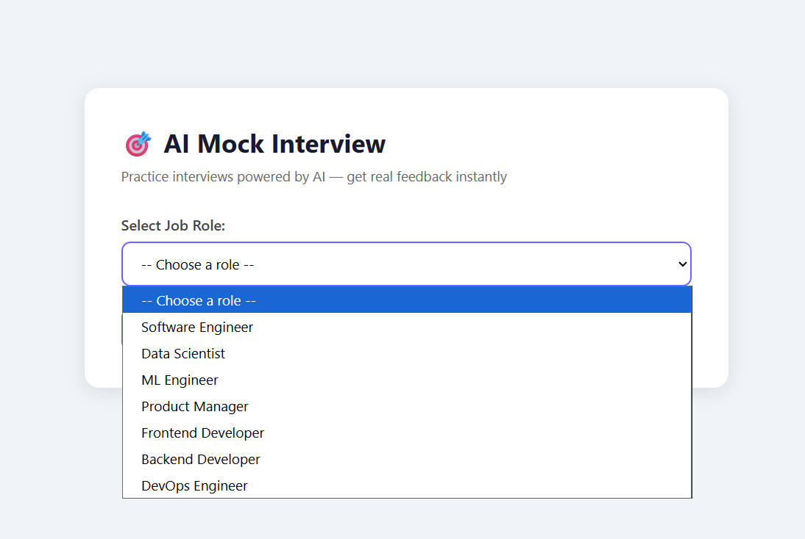
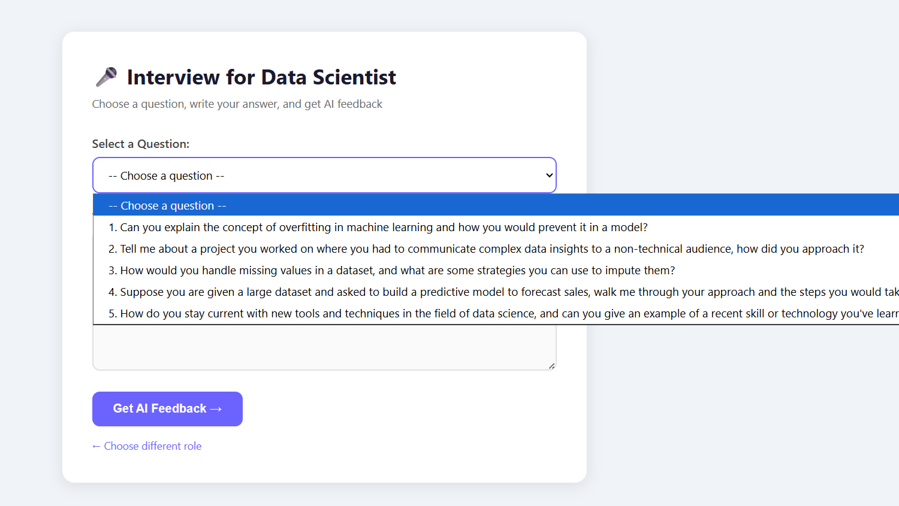
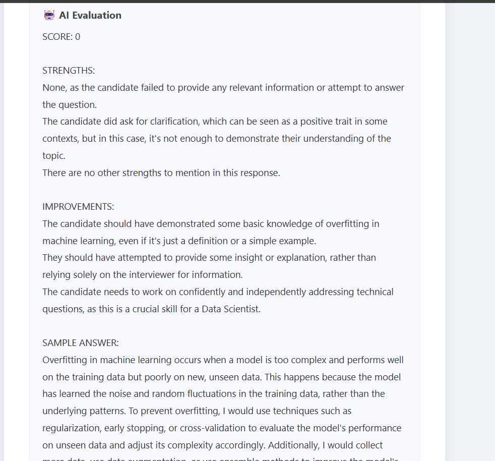

# AI-Powered Mock Interview System

<div align="center">


<br/>


<br/>


<br/>

### 🔗 [Live Demo](https://mock-interview-ai-1kjd.onrender.com) • [GitHub](https://github.com/Anushka190921/mock-interview-ai)

</div>

---

## 📌 About

An AI-powered mock interview web app that helps candidates practice
for real job interviews. Select your target role and difficulty level,
answer AI-generated questions, and get instant detailed feedback
with scores, strengths, improvements, and ideal sample answers.

---

## ✨ Features

| Feature | Status |
|---------|--------|
| 15 Job Roles Supported | ✅ Done |
| 3 Difficulty Levels (Fresher/Mid/Senior) | ✅ Done |
| AI Question Generation | ✅ Done |
| Answer Evaluation with Score /10 | ✅ Done |
| Strengths & Improvements Feedback | ✅ Done |
| Ideal Sample Answer | ✅ Done |
| Live Deployment on Render | ✅ Done |
| Voice Input | ⏳ Coming Soon |
| Interview History | ⏳ Coming Soon |
| PDF Report Download | ⏳ Coming Soon |

---

## 🛠️ Tech Stack

| Layer | Technology |
|-------|-----------|
| Backend | Python, Flask |
| AI | Groq API (LLaMA 3.3 70B) |
| Frontend | HTML, CSS, JavaScript |
| Deployment | Render + Gunicorn |
| Security | python-dotenv |

---

## 📸 Screenshots

### Home Page


### Interview Page


### Feedback Page


---

## 🧠 How It Works

1.User selects job role + difficulty level

↓
2.Flask sends prompt to Groq API

↓
3.LLaMA 3.3 generates 5 role-specific questions

↓
4.User picks a question and types their answer

↓
5.AI evaluates → Score + Strengths + Improvements + Sample Answer

↓
6.Results displayed on feedback page

---

## 📁 Project Structure

mock-interview-ai/

├── app.py                  ← Flask routes

├── utils/

│   ├── llm.py              ← Groq API integration

│   └── prompts.py          ← AI prompt templates

├── templates/

│   ├── index.html          ← Home page

│   ├── interview.html      ← Questions page

│   └── feedback.html       ← AI feedback page

├── static/css/

│   └── style.css

├── screenshots/

├── requirements.txt

└── .env                    ← API keys (not on GitHub)

---

## 🚀 Run Locally

```bash
git clone https://github.com/Anushka190921/mock-interview-ai.git
cd mock-interview-ai
python -m venv venv
venv\Scripts\activate
pip install -r requirements.txt
# Add GROQ_API_KEY to .env file
python app.py
```

Visit `http://127.0.0.1:5000`

---

## 🚧 Challenges & Learnings

### 1. Model Deprecation
- Faced `BadRequestError` when Groq deprecated `llama3-8b-8192`
- Fixed by migrating to `llama-3.3-70b-versatile`

### 2. Prompt Engineering
- Designed strict output formats for consistent AI responses
- Used labeled sections (SCORE, STRENGTHS, IMPROVEMENTS)

### 3. Session Management
- Used Flask `session` to persist data across multiple routes

### 4. First Deployment
- Configured Gunicorn + Render with secure environment variables

---

## 👩‍💻 Author

**Anushka** — BTech CSE (AI), 2nd Year

[](https://www.linkedin.com/in/anushka-773aa5337)
[](https://github.com/Anushka190921)

